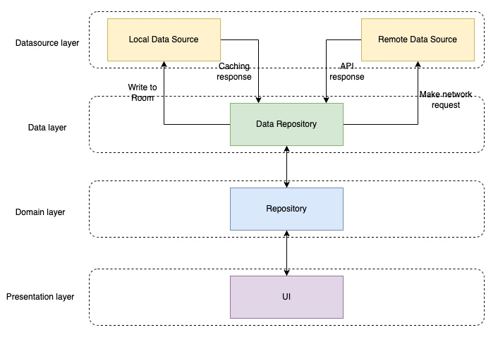

# Currency Buddy V2

**Currency Buddy V2** is an enhanced multi-module currency converter app for Android, built with Jetpack Compose and following modern best practices. The project has been re-architected for improved modularity, maintainability, and performance. Whether you’re looking for a quick conversion or interested in exploring the modular design, Currency Buddy V2 has you covered.

[](https://github.com/ericwafula/currencybuddyV2/actions)  
[](LICENSE)

---

## Table of Contents

- [Tech Stack & Tools Used](#tech-stack--tools-used)
- [Features](#features)
- [Architecture & Modularization](#architecture--modularization)
- [Getting Started](#getting-started)
    - [Prerequisites](#prerequisites)
    - [Installation](#installation)
    - [Running the App](#getting-started)
- [Dependencies & Tools](#tech-stack--tools-used)
- [Contributing](#contributing)
- [Support](#support)
- [License](#license)

---

## Tech Stack & Tools Used
- [Kotlin](https://developer.android.com/kotlin) - Most of the Android community uses Kotlin as their preferred choice of language.
- Jetpack:
    - [Jetpack Compose](https://developer.android.com/jetpack/compose) - Jetpack Compose is Android’s modern toolkit for building native UI. It simplifies and accelerates UI development on Android. Quickly bring your app to life with less code, powerful tools, and intuitive Kotlin APIs.
    - [Android KTX](https://developer.android.com/kotlin/ktx.html) - Android KTX is a set of Kotlin extensions that are included with Android Jetpack and other Android libraries. KTX extensions provide concise, idiomatic Kotlin to Jetpack, Android platform, and other APIs.
    - [AndroidX](https://developer.android.com/jetpack/androidx) - The androidx namespace comprises the Android Jetpack libraries. It's a major improvement to the original Android [Support Library](https://developer.android.com/topic/libraries/support-library/index), which is no longer maintained.
    - [Lifecycle](https://developer.android.com/topic/libraries/architecture/lifecycle) - Lifecycle-aware components perform actions in response to a change in the lifecycle status of another component, such as activities and fragments. These components help you produce better-organized, and often lighter-weight code, that is easier to maintain.
    - [ViewModel](https://developer.android.com/topic/libraries/architecture/viewmodel) - The ViewModel class is a business logic or screen level state holder. It exposes state to the UI and encapsulates related business logic. Its principal advantage is that it caches state and persists it through configuration changes.
    - [Room Database](https://developer.android.com/topic/libraries/architecture/room) - The Room persistence library provides an abstraction layer over SQLite to allow fluent database access while harnessing the full power of SQLite.
    - [WorkManager](https://developer.android.com/topic/libraries/architecture/workmanager) - WorkManager is an API that makes it easy to schedule deferrable, asynchronous tasks that are expected to run even if the app exits or the device restarts.
- - [Ktor Client](https://ktor.io/) is a Network Client Provider for Android a asynchronous HTTP client, which allows you to make requests and handle responses, extend its functionality with plugins, such as authentication, JSON serialization, and more
- [Koin ](https://insert-koin.io/) - The pragmatic Kotlin & Kotlin Multiplatform Dependency Injection framework.
- [Kotlin Coroutines](https://developer.android.com/kotlin/coroutines) - A concurrency design pattern that you can use on Android to simplify code that executes asynchronously and it's the recommended way for asynchronous programming on Android.
- [Kotlin Flow](https://developer.android.com/kotlin/flow) - In coroutines, a flow is a type that can emit multiple values sequentially, as opposed to suspend functions that return only a single value.
- [Ktor Client](https://ktor.io/) is a Network Client Provider for Androidi a asynchronous HTTP client, which allows you to make requests and handle responses, extend its functionality with plugins, such as authentication, JSON serialization, and more.
- [Kotlin Serialization](https://kotlinlang.org/docs/serialization.html) - Kotlin Serialization is a framework that consists of a compiler plugin, which automatically generates visitor code for objects, and runtime library, which uses generated code to serialize objects to and from formats like JSON, ProtoBuf, and others.
- [Timber](https://github.com/JakeWharton/timber)- A logger with a small, extensible API which provides utility on top of Android's normal Log class.
- [Mockk](https://github.com/mockk/mockk)- A mocking library for Kotlin
- [Junit5](https://github.com/mannodermaus/android-junit5)-A Gradle plugin that allows for the execution of JUnit 5 tests in Android environments using Android Gradle Plugin 8.0.0 or later.
- [Firebase Crashlytics  & Analytics](https://firebase.google.com/docs/analytics)- an unlimited analytics solution for reporting distinct events.

## Features

- **Intuitive UI:** A clean and simple interface powered by Jetpack Compose for effortless currency conversion.
- **Modular Design:** Separation of concerns through a layered architecture combined with feature-based modularization.
- **Accurate Conversions:** Real-time currency conversion using up-to-date exchange rates.
- **Offline First:** Caching of currency data for seamless operation even without an active internet connection.
- **Best Practices:** Updated to leverage modern Android development techniques and libraries for improved performance and maintainability.

---

## Architecture & Modularization



Currency Buddy V2 has been designed with a focus on modularity and separation of concerns. The project follows both layered and feature-based modularization strategies:

- **Core Module:**
    - **Data Layer:** Handles data retrieval, caching, and network operations.
    - **Domain Layer:** Contains business logic and use cases.
    - **Presentation Layers:**
        - `presentation:ui` for UI components that can be shared across features.
        - `presentation:designsystem` for reusable UI elements and theming.

- **Current Feature Modules:**
    - **converter:** Focuses on the currency conversion feature, with its own set of layers to keep functionality isolated and testable.

**Coming Soon:**
- **auth:** Manages the onboarding flow with dedicated layers for data, domain, and presentation.

This structure not only helps in maintaining clear boundaries between different parts of the app but also paves the way for easier scalability and testing.

---

## Getting Started

### Prerequisites

- **Android Studio:** Ensure you have the latest version installed.
- **Android SDK:** Up-to-date SDK tools for the API level targeted by the project.
- **Environment Variables:**  
  The app requires the following environment variables to be set:
    - `API_KEY`: Your API key for currency conversion: This is just a placeholder at the moment.  
      Example: `API_KEY=abc`
    - `CONVERTER_BASE_URL`: Base URL for fetching currency conversion data.  
      Example: `CONVERTER_BASE_URL=https://cdn.jsdelivr.net/npm/@fawazahmed0/currency-api@latest/v1/currencies/`
    - `CURRENCY_DETAILS_URL`: URL for obtaining additional currency details.  
      Example: `CURRENCY_DETAILS_URL=https://ericwafula.github.io/currency-details/currencies.json`

### Installation

1. **Fork and Clone the Repository:**

   ```bash
   git clone https://github.com/ericwafula/currencybuddyV2.git
   cd currencybuddyV2